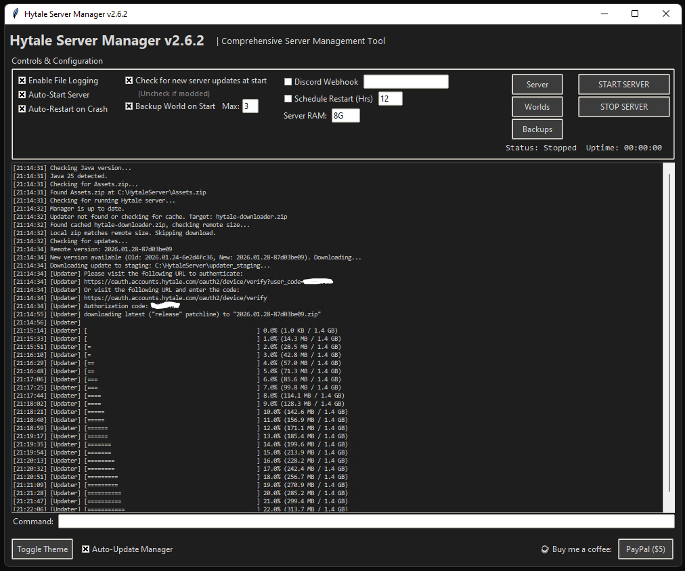

# Hytale Server Manager

A Python automation script for managing Dedicated Hytale Servers.



## Features

*   **GUI & Console Modes**: Use the modern graphical interface or headless console mode (`-nogui`) for flexible management.
*   **Robustness**: Automated crash detection, scheduled restarts, and world backups (zips locally before starting).
*   **Reliable Auto-Updates**: Checks `git master` via HTTP to automatically download and install updates using a safe installer script.
*   **Performance**: Detects and enables Ahead-Of-Time (`HytaleServer.aot`) cache for faster startups.
*   **Notifications**: Integrated Discord Webhooks for server status changes (Start, Stop, Crash).
*   **Background Scanning**: Automatically checks for server updates every 30 minutes and restarts if found.
*   **Platform Checks**: auto-detects Java 25 and `Assets.zip` requirements.

## Requirements
*   **Operating System**: Windows or Linux
*   **Python 3.x**:
    *   **Windows**: [Download from Python.org](https://www.python.org/downloads/windows/) (Ensure "Add Python to PATH" is checked)
    *   **Linux**: Usually pre-installed. (`sudo apt install python3 python3-tk` might be needed for GUI).

*   **Java 25**: [Download from Adoptium](https://adoptium.net/temurin/releases/?version=25)
*   **Internet Connection**: Required for downloading updates and Discord webhooks.

## Installation

1.  Clone this repository or download `hytale_server_manager.py` and `version.py`.
2.  Place the scripts in your desired server folder.

## Usage

### Graphical Mode (Default)
Run the script without arguments to open the GUI:
```bash
python hytale_server_manager.py
```
*   **Controls**: Toggle Backups, Discord Webhooks, and Auto-Restart directly from the UI.
*   **Quick Access**: Open Server, World, and Backup folders.
*   **Themes**: Toggle between Light and Dark mode.

### Console Mode (Headless)
Run with the `-nogui` argument for CLI-only operation:
```bash
python hytale_server_manager.py -nogui
```
*   Configuration is loaded from `hytale_server_manager_config.json`.

### Help
View all command line arguments:
```bash
python hytale_server_manager.py -help
```

## Configuration

Settings are saved to `hytale_server_manager_config.json`. Key features:
```json
{
  "enable_backups": true,
  "max_backups": 3,
  "enable_discord": true,
  "discord_webhook": "YOUR_WEBHOOK_URL",
  "enable_auto_restart": true,
  "enable_schedule": false,
  "restart_interval": 12,
  "manager_auto_update": true
}
```

## Versioning

Current Version: 3.2.0
See `version.py` for the tracked version number.
